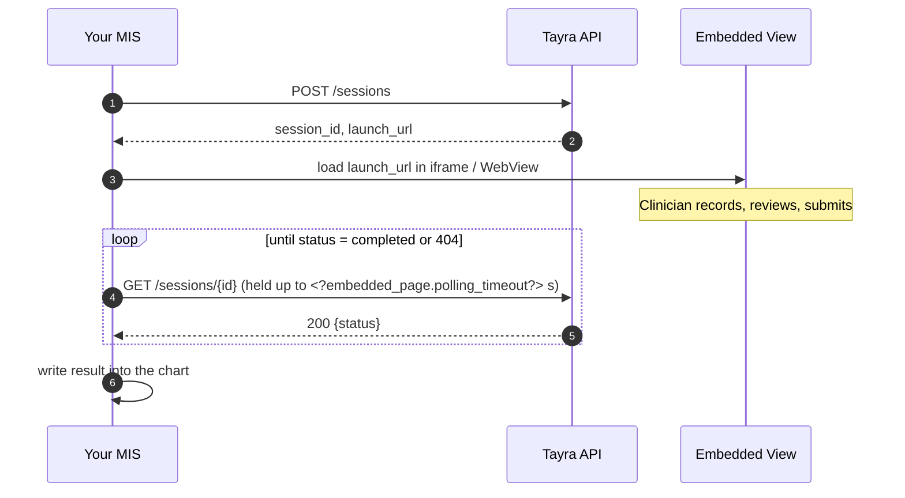

# Embedded Page

### Prerequisites

1. Obtain your API key from the Tayra team during onboarding. Send as `Authorization: <api_key>`. Store server-side only.
2. Allow outbound HTTPS and WSS (port 443) from clinician machines to `<?API_BASE_URL?>` and `<?APP_BASE_URL?>`. All connections are outbound. If an L7 proxy inspects traffic, ensure it permits the `Upgrade: websocket` header for these hosts.

## Integration flow

Tayra runs as an embedded view inside your MIS. For each encounter you create a session over HTTPS, supplying the note structure you need. You receive a URL to embed. The clinician records and reviews the consultation inside that view. You long-poll the session status until it reaches `completed`, then write the note into the patient chart.

**Everything is ordinary outbound HTTPS.** No inbound access, no open ports, no persistent protocol.

1. **Create a session** — one POST returns a `session_id` and a launch URL (the ID is a cryptographically random token — safe to pass to the workstation, no other credentials needed there)
2. **Embed the view** — load the URL in an iframe or WebView with microphone permission
3. **Poll for the note** — `GET` returns the session status: `in_progress`, `interrupted` (with partial content if the connection dropped), or `completed` with the final note



## 1. Create a session

!!! warning "No patient identifiers in requests"

    Tayra receives no patient data. `title` is the only free-text field you send. **Never put names, DOB, MRNs, or any identifier in it.**

Call when the clinician opens the encounter, not in advance. The launch URL is short-lived.

```
POST /sessions
Authorization: <api_key>
```

**Option A** — you define the note structure (see [Custom Template](custom-template.md)):

```json
{ "title":    "Follow-up",
  "locale":   "en",

  "template": {
    "type": "object",
    "properties": {
      "symptoms": {
        "type": "array",
        "description": "List of reported symptoms",
        "items": { "type": "string" }
      },
      "diagnosis": {
        "type": ["string", "null"],
        "description": "Clinical diagnosis"
      }
    },
    "required": ["symptoms", "diagnosis"]
  }
}
```

**Option B** — use a pre-configured template:

```json
{ 
  "title":       "Follow-up",
  "locale":      "en",

  "template_id": "wf903-..." 
}
```

**201 Created**

```json
{ 
  "session_id":  "8h4f-...",
  "launch_url":  "<?APP_BASE_URL?>/session?t=...",
  "expires_at":  "2026-08-12T09:15:02Z"
}
```

### Request fields

| Field | Requirement |
|---|---|
| `template` | **Required unless you send `template_id`.** The note structure: field identifiers, labels, and optional hints. Up to <?embedded_page.max_fields?> total properties; aggregate string budget <?embedded_page.max_label_len?> characters. |
| `template_id` | **Alternative to `template`.** Names a pre-configured note structure held for your tenant. Send exactly one of `template` or `template_id`. |
| `title` | Optional. Shown in the view header so the clinician can confirm the encounter. **No patient identifiers.** |
| `locale` | **Required.** Transcription and interface language. Two-letter ISO 639-1 code: `en`, `uk`, `pl`, `fr`, `lv`. |
| `doctor_id` | Optional. UUID of the doctor for this encounter. |


## 2. Embed the view

Load `launch_url` in an iframe or native WebView. It occupies the space it is given.

```html
<iframe
  src="{launch_url}"
  allow="microphone"
  style="width:100%;min-width:640px;height:100%;min-height:720px;border:0">
</iframe>
```

| Requirement | Detail |
|---|---|
| **Load promptly** | Single-use token, valid **<?embedded_page.launch_token_ttl?> seconds**. Expired → `launch_token_expired`. Already used → `launch_token_consumed`. |
| **Do not reload** | Reloading or unmounting invalidates the view. Use `relaunch` for a fresh URL. |
| **Microphone** | iframe: `allow="microphone"`. Desktop WebView: grant via host permission API. |
| **Size** | Recommended 640 × 720 CSS pixels or above (half of a 1280×720 HD screen, split side-by-side). Responsive to any container size. |

### Relaunch

```
POST /sessions/{session_id}/relaunch
Authorization: <api_key>
```

**200 OK**

```json
{ "launch_url": "...", "expires_at": "..." }
```

The consultation continues where it left off.

## 3. Poll for the note

Long-poll the session. The response always includes a `status` field indicating the current state.

```
GET /sessions/{session_id}?wait=<?embedded_page.polling_timeout?>
Authorization: <api_key>
```

Recording in progress — **200 OK**

```json
{
  "status": "in_progress",
  "content": null,
  "transcript": null,
  "duration_seconds": 0
}
```

Connection interrupted, partial result available — **200 OK**

```json
{
  "status":     "interrupted",
  "content":    {...},
  "transcript": "...",
  "duration_seconds": 60
}
```

If the clinician reconnects, status returns to `in_progress`.

Clinician submitted — **200 OK**

```json
{ 
  "status":           "completed",
  "content":          {...},
  "transcript":       "...",
  "duration_seconds": 754
}
```

Session cancelled or expired — **404 Not Found**

```json
{ "error": { "code": "session_not_found" } }
```

### Loop mechanics

1. Send `GET` with `wait`. Server holds the connection until a status transition or timeout.
2. `status: "in_progress"` — no change yet; re-poll.
3. `status: "interrupted"` — connection dropped; `content` contains the partial result. Decide whether to wait for reconnection or persist as-is.
4. `status: "completed"` — final note ready; persist to chart and stop polling.
5. `404` — session cancelled or expired; stop polling.

### Practical notes

| Concern | What to do |
|---|---|
| **Client timeout** | Set above the wait — e.g. `<?embedded_page.polling_timeout?>` + 15 s. |
| **Short-polling fallback** | If long-polling is not feasible, omit `wait` and poll every `<?embedded_page.min_poll_s?>` s. Long-polling is recommended. |
| **Failures** | Reissue on drop or timeout. Back off on repeated `5xx`. |
| **Concurrency** | One loop per session. |
| **Note retention** | Finalized notes are retained for <?embedded_page.note_retention?> as a recovery backstop. |


## 4. postMessage (optional)

When the clinician submits the note, the embedded view posts a `message` event to the parent window. This is an optional alternative to detecting completion via polling.

```js
window.addEventListener('message', (event) => {
  if (event.data?.type === 'tayra:completed') {
    // event.data contains the final note
  }
});
```

**Event payload**

```json
{
  "type":             "tayra:completed",
  "content":          {...},
  "transcript":       "...",
  "duration_seconds": 754
}
```

| Field | Description |
|---|---|
| `type` | Always `"tayra:completed"`. |
| `content` | Structured note matching the template schema. |
| `transcript` | Full transcript text. |
| `duration_seconds` | Session recording duration in seconds. |

!!! note
    The event fires once, on submission. It is a convenience signal — **polling remains the authoritative delivery mechanism** and must not be removed. If the iframe is loaded cross-origin or inside a native WebView without a JS bridge, the event may not be receivable.


## Errors

```json
{ "error": {
    "code":      "session_not_found",
    "message":   "Unknown or expired session.",
    "retryable": false,
    "trace_id":  "trc_9f2a..." } }
```

| Code | HTTP | Action |
|---|---|---|
| `launch_token_expired` | 410 | URL older than <?embedded_page.launch_token_ttl?> s. Call `relaunch`. |
| `launch_token_consumed` | 410 | URL already used. Call `relaunch`. |
| `session_not_found` | 404 | Session expired or cancelled. Stop polling. |
| `rate_limited` | 429 | Retry after `retry_after_ms`. |
| `internal` | 5xx | Retry with backoff. Quote `trace_id` in support requests. |

Standard errors (`400`, `401`, `409`) use the same envelope and are self-explanatory during development.

## Limits

| Limit | Value |
|---|---|
| Total properties per schema | <?embedded_page.max_fields?> |
| Aggregate string budget | <?embedded_page.max_label_len?> characters |
| Launch URL validity | <?embedded_page.launch_token_ttl?> s, single use |
| Note retention | <?embedded_page.note_retention?> |
| Max long-poll wait | <?embedded_page.polling_timeout?> s |
| Min short-poll interval | <?embedded_page.min_poll_s?> s |

