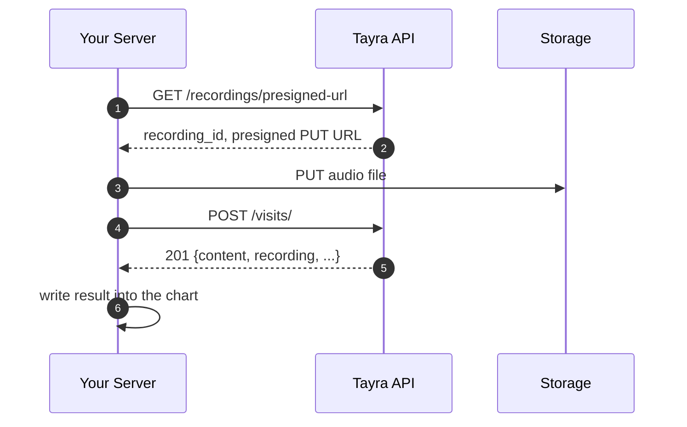

# Visit API

### Prerequisites

1. Obtain your API key from the Tayra team during onboarding. Send as `Authorization: <api_key>`. Store server-side only.
2. Allow outbound HTTPS (port 443) from your servers to `<?API_BASE_URL?>`. All connections are outbound.

## Integration flow

Upload a pre-recorded audio file, then call the API to generate a structured clinical note. The response is synchronous — no polling required.

1. **Get a presigned URL** — request an upload destination and receive a `recording_id`
2. **Upload the recording** — PUT the audio file to the presigned URL
3. **Create a visit** — POST with the recording ID and template; receive the note in the response



## 0. Create a doctor (optional)

Register the doctor once and reuse the returned `id` as `doctor_id` in subsequent visits. Linking visits to a doctor lets you track usage per clinician and view per-doctor analytics in the admin panel.

```
POST /doctors
Authorization: <api_key>
```

```json
{
  "last_name":  "Smith",
  "first_name": "Jane",
  "patronymic": null
}
```

**201 Created**

```json
{
  "id":         "d4c8b1a2-...",
  "last_name":  "Smith",
  "first_name": "Jane",
  "patronymic": null
}
```

| Field | Requirement |
|---|---|
| `last_name` | **Required.** |
| `first_name` | **Required.** |
| `patronymic` | Optional. |

## 1. Get a presigned URL

```
GET /recordings/presigned-url?extension=mp3
Authorization: <api_key>
```

| Parameter | Requirement |
|---|---|
| `extension` | Optional. Appended to the storage key (e.g. `mp3`, `wav`). |

**200 OK**

```json
{
  "id":  "9a3b1c2d-...",
  "url": "https://..."
}
```

| Field | Description |
|---|---|
| `id` | Recording UUID. Pass this as `recording_id` when creating the visit. |
| `url` | Presigned PUT URL. Valid for **<?visit.presigned_url_ttl?>** seconds, single use. |

## 2. Upload the recording

PUT the audio file directly to the presigned URL. No authorization header — the URL is pre-signed.

```
PUT {url}
Content-Type: audio/mpeg
```


## 3. Create a visit

```
POST /visits/
Authorization: <api_key>
```

**Option A** — you define the note structure (see [Custom Template](custom-template.md)):

```json
{
  "template": {
    "type": "object",
    "properties": {
      "symptoms": {
        "type": "array",
        "description": "List of reported symptoms",
        "items": { "type": "string" }
      },
      "diagnosis": {
        "type": ["string", "null"],
        "description": "Clinical diagnosis"
      }
    },
    "required": ["symptoms", "diagnosis"]
  },
  "lang_code":     "en",
  "recording_id":  "9a3b1c2d-...",
  "doctor_id":     "d4c8b1a2-..."
}
```

**Option B** — use a pre-configured template:

```json
{
  "template_id":   "wf903-...",
  "recording_id":  "9a3b1c2d-...",
  "doctor_id":     "d4c8b1a2-..."
}
```

### Request fields

| Field | Requirement |
|---|---|
| `template` | **Required unless you send `template_id`.** The note structure as a JSON Schema. Up to <?embedded_page.max_fields?> total properties; aggregate string budget <?embedded_page.max_label_len?> characters. |
| `template_id` | **Alternative to `template`.** UUID of a pre-configured note structure held for your tenant. Send exactly one of `template` or `template_id`. |
| `lang_code` | **Required when using inline `template`.** Transcription and note language. Two-letter ISO 639-1 code: `en`, `uk`, `pl`, `fr`, `lv`. Ignored when using `template_id` (language comes from the stored template). |
| `recording_id` | **Required.** UUID returned from the presigned URL step. |
| `doctor_id` | Optional. UUID of the doctor for this encounter. Create via [`POST /doctors`](https://api.tayra.health/docs#/default/create_doctor_doctors_post). |

**201 Created**

```json
{
  "id": "f7e2a1b3-...",
  "template": {
    "id":    "wf903-...",
    "title": "Follow-up"
  },
  "recording": {
    "id":               "9a3b1c2d-...",
    "duration_seconds":  754
  },
  "doctor": {
    "id":         "d4c8b1a2-...",
    "last_name":  "Smith",
    "first_name": "Jane",
    "patronymic":  null
  },
  "content": {
    "symptoms":  ["headache", "fatigue"],
    "diagnosis": "Tension-type headache"
  }
}
```

### Response fields

| Field | Description |
|---|---|
| `id` | Visit UUID. |
| `template` | Template used. Omitted when an inline `template` was provided. |
| `recording` | Recording metadata. `duration_seconds` is the audio duration in seconds. |
| `doctor` | Doctor associated with the visit. |
| `content` | Structured note matching the template schema. |
| `selected_templates` | List of sub-template titles when the template uses a selector. Omitted otherwise. |

## Errors

```json
{ "detail": "Recording not found." }
```

| HTTP | When | Action |
|---|---|---|
| 400 | Invalid audio format. | Check the uploaded file is valid audio. |
| 403 | No recording balance remaining. | Contact Tayra to top up. |
| 404 | Recording, template, or doctor ID not found. | Verify the UUIDs. |
| 422 | Inline schema validation failed. | Fix the `template` body. See [Custom Template](custom-template.md). |
| 5xx | Internal error. | Retry with backoff. |

Standard errors (`401`) use the same envelope and are self-explanatory during development.

## Limits

| Limit | Value |
|---|---|
| Presigned URL validity | <?visit.presigned_url_ttl?> s, single use |
| Total properties per schema | <?embedded_page.max_fields?> |
| Aggregate string budget | <?embedded_page.max_label_len?> characters |
